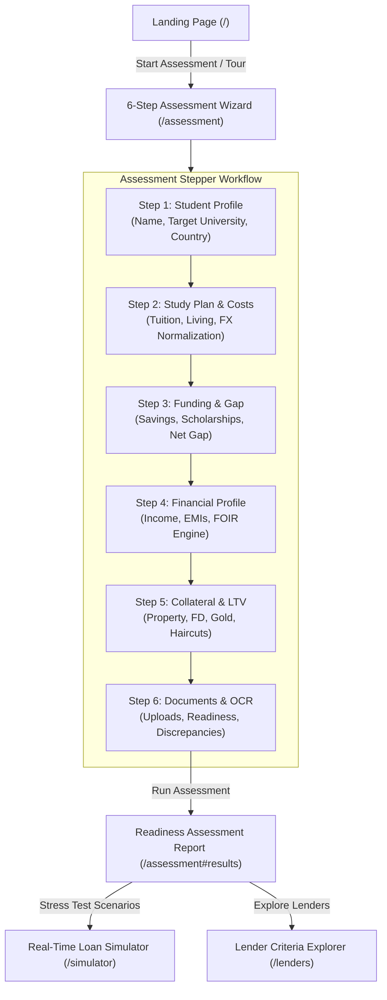

# Finora — Application Flow & User Journey Specification

> **Document Status:** Authoritative UX & Flow Specification  
> **Interface Architecture:** Next.js App Router Single-Page Stepper Wizard + Spotlight Onboarding Tour  
> **Target Audiences:** Product Managers, Frontend Engineers, QA Engineers, Assignment Reviewers

---

## 1. End-to-End User Journey Overview

---

## 2. Global Navigation & Guided Spotlight Tour

### 2.1 Navigation Bar Elements
- **Brand Identity:** Finora Neo-Brutalist logo linking to `/`.
- **Primary Routes:**
  - `Assessment` (`/assessment`): Core 6-step readiness stepper.
  - `Simulator` (`/simulator`): Interactive FOIR stress-testing sandbox.
  - `Lenders` (`/lenders`): Transparent rulebook explorer for the 5 partner institutions.
  - `Documents` (`/documents`): Central pre-underwriting document vault.
- **Header CTAs:**
  - `Take Tour`: Triggers the 14-step spotlight onboarding walkthrough.
  - `Load Demo`: Populates pre-configured candidate profiles (e.g. Aarav Mehta) for instant evaluation.

### 2.2 14-Step Guided Spotlight Tour
The spotlight tour highlights critical UI components in sequence:
1. **Hero Value Proposition:** Introduction to deterministic loan assessment.
2. **Step Stepper:** Explains the 6 progressive evaluation phases.
3. **Multi-Currency Inputs:** Highlights automated FX conversion.
4. **Funding Gap Card:** Explains the floored net gap metric.
5. **FOIR Indicator:** Demonstrates monthly debt service vs income ratio.
6. **LTV Calculator:** Highlights collateral haircuts and security coverage.
7. **Document Vault:** Explains magic-byte verification and OCR extraction.
8. **Discrepancy Engine:** Demonstrates declared income vs salary slip comparison.
9. **Lender Matching:** Explains hard constraints vs review triggers.
10. **Lender Card Details:** Inspects granular reason codes (SBI, BOB, BOI, HDFC Credila, Auxilo).
11. **Readiness Band:** Explains the 4 readiness tiers (Strong, Moderate, Conditional, High Risk).
12. **Recommendations Engine:** Highlights actionable improvement steps.
13. **FOIR Simulator:** Demonstrates real-time parameter sliding.
14. **PDF Export & Share:** Walks through report export capabilities.

---

## 3. Step-by-Step Wizard Specification

### Step 1: Student Profile & Destination
- **User Actions:** Enter student legal name, contact email, country of origin (default: India), destination country (USA, UK, Canada, Australia, Germany, Ireland, Singapore, France), target university, and program name.
- **System Actions:** Validates input via Zod schema, creates or updates student record via `POST /api/students`, stores student ID in React wizard state.
- **Validation Rules:** Valid email format required; prevents duplicate email collisions (`409 Conflict`).

### Step 2: Study Plan & Academic Costs
- **User Actions:** Enter tuition fee, living expenses, travel/relocation costs, health insurance, and miscellaneous fees; select native currency (USD, EUR, GBP, CAD, AUD) and course duration (months).
- **System Actions:** Calls `POST /api/students/{id}/study-plan`, deterministically applies exchange rate, calculates total and annualized costs in both native currency and INR.
- **Validation Rules:** All expenses must be $\ge 0.00$; negative values rejected immediately.

### Step 3: Self-Funding & Gap Analysis
- **User Actions:** Add declared funding items across 4 categories: Personal Savings, Scholarships, Family Contributions, and Other confirmed sources.
- **System Actions:** Normalizes all sources to INR via `POST /api/students/{id}/funding`, calculates `total_funding_inr`, computes `funding_gap = max(0, total_study_cost - total_funding)`.
- **UI Presentation:** Displays prominent Neo-Brutalist metric card showing Total Cost, Available Funding, and Net Funding Gap.

### Step 4: Household Financial Profile & FOIR
- **User Actions:** Enter primary/co-borrower monthly net income, existing monthly EMIs, household living expenses, requested loan amount, loan tenure (months), and indicative interest rate (%).
- **System Actions:** Computes proposed monthly EMI via standard compound reducing-balance formula, calculates FOIR ratio and percentage, assigns risk tier badge (`low_risk`, `moderate_risk`, `high_risk`, `critical_risk`).
- **UI Presentation:** Displays live color-coded FOIR gauge with clear plain-language debt burden interpretation.

### Step 5: Collateral Valuation & LTV Haircuts
- **User Actions:** Add pledged collateral assets (Residential/Commercial Property, Fixed Deposits, Gold, Government Bonds, Insurance Policies, Other Assets), specify ownership status (Sole, Joint Parent, Joint Third Party, Third Party), market value, and existing encumbrance/mortgage.
- **System Actions:** Calls `POST /api/students/{id}/collateral`, deducts encumbrances, applies asset-specific haircuts and ownership factors, computes `eligible_collateral_value_inr`, evaluates LTV ratio and `coverage_status` (`fully_secured`, `partially_secured`, `unsecured`).

### Step 6: Pre-Underwriting Documents & Discrepancy Reconciliation
- **User Actions:** Upload supporting files (Admission Offer Letter, Passport, Salary Slips, Bank Statements, ITR, Property Deeds).
- **System Actions:** Validates binary magic header bytes via `POST /api/students/{id}/documents`, saves file to isolated storage, triggers local OCR/regex extraction via `POST /api/documents/{id}/extract`, evaluates income discrepancies via `GET /api/students/{id}/discrepancies`.
- **UI Presentation:** Displays document readiness checklist matrix and highlights any detected income variance flags exceeding tolerance (default: 10%).

---

## 4. Assessment Results & Report Generation

### 4.1 Orchestration Trigger (`Run Assessment`)
When the applicant clicks **"Run Loan Readiness Assessment"**:
1. Frontend submits `POST /api/students/{id}/assessments`.
2. Backend orchestrator evaluates the candidate's financial snapshot against the 5 partner lenders (SBI, BOB, BOI, HDFC Credila, Auxilo Finserve).
3. Evaluates all hard constraints and review triggers, computing a weighted match score (0–100%) and assigning outcome states (`potential_match`, `needs_review`, `not_a_match`).
4. Creates an immutable point-in-time snapshot in `assessments`, `assessment_results`, and `assessment_rule_results`.

### 4.2 Report Sections
- **Executive Summary:** Readiness Band badge, overall readiness score, matched lenders count.
- **Financial Breakdown:** Side-by-side cards for Total Study Cost, Self-Funding, Funding Gap, Monthly EMI, FOIR, and LTV.
- **Lender Cards:** Expandable cards for each lender detailing interest rate ranges, loan maximums, passed rules, failed constraints, and review triggers.
- **Actionable Remediation Checklist:** Specific suggestions to improve approval probability (e.g. adding collateral, extending tenure, adding co-borrower).
- **Export Capabilities:** Printable view / PDF export layout formatted for banking review.

---

## 5. Interactive Simulator Workflow

Located at `/simulator`:
- **Real-Time Sliders:** Loan Amount slider, Tenure slider (12 to 360 months), Interest Rate slider (5% to 20%), Income adjustment.
- **Instant Response:** Calls `POST /api/simulator/foir` and `POST /api/simulator/lender-impact` with zero latency.
- **Sandbox Isolation:** Simulator experimentation never overwrites or mutates the official historical assessment report.

---

## 6. State Preservation & Error Recovery

- **Backward/Forward Navigation:** Navigating between steps preserves all form state without data loss.
- **Page Refresh:** The wizard restores persisted candidate data from the backend using the active `student_id`.
- **Network Resilience:** Transient network dropouts display retry banners while retaining unsubmitted user inputs.
- **Input Boundaries:** Form inputs block non-numeric characters in monetary fields and prevent negative expense values.
