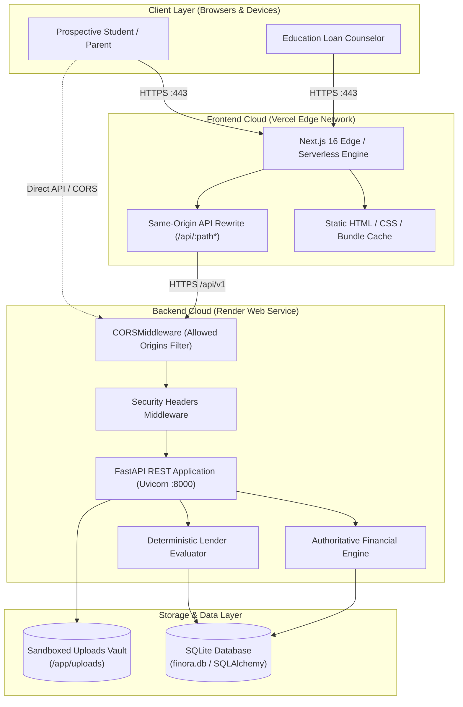
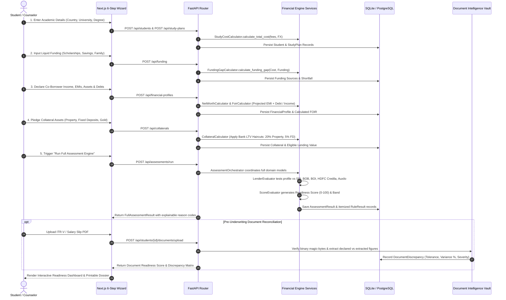
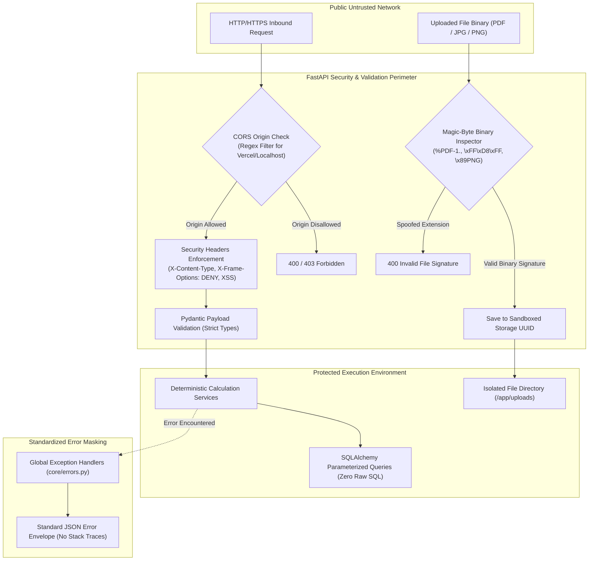

# Finora — System Architecture & Technical Specification

> **Canonical Document:** This is the authoritative system architecture reference for the Finora platform.
> **Current Status:** Verified Implementation State (October 2026)

---

## 1. System Overview & Architectural Objectives

**Finora** is a deterministic financial intelligence and education-loan pre-underwriting platform. The architecture is engineered around three foundational pillars:

1. **Connected Context:** A unified borrower model linking candidate academic plans, multi-currency study costs, liquid funding sources, co-borrower financial profiles, and pledged collateral assets into an immutable audit snapshot.
2. **Bounded Actions:** Strict server-side validation enforcing hard lender eligibility limits, debt service ceilings (FOIR), and collateral loan-to-value (LTV) haircuts before sanction matching.
3. **Verified Results & Explainability:** 100% deterministic rule evaluations where every lender verdict (Direct Approval, Conditional, Ineligible) is paired with human-readable diagnostic reason codes and actual vs. expected threshold comparisons.

---

## 2. Verified Technology Stack

| Layer | Technology | Specification / Version | Source Path in Repository |
| :--- | :--- | :--- | :--- |
| **Frontend Framework** | Next.js (App Router) | Next.js `16.4.0` (Turbopack enabled) | [`package.json`](file:///home/puneetyadav1625/Projects/Finora/package.json), [`next.config.ts`](file:///home/puneetyadav1625/Projects/Finora/next.config.ts) |
| **UI Runtime** | React & TypeScript | React `19.0.0`, TypeScript `5.x` | [`tsconfig.json`](file:///home/puneetyadav1625/Projects/Finora/tsconfig.json) |
| **Styling & Design System** | Tailwind CSS & Neo-Brutalism | Tailwind CSS `v4.x` with high-contrast tokens | [`app/globals.css`](file:///home/puneetyadav1625/Projects/Finora/app/globals.css), [`components/ui/NeoPrimitives.tsx`](file:///home/puneetyadav1625/Projects/Finora/components/ui/NeoPrimitives.tsx) |
| **Icons & Visuals** | Lucide React | Lucide React `^1.16.0` | [`package.json`](file:///home/puneetyadav1625/Projects/Finora/package.json) |
| **Backend Framework** | FastAPI | Python `3.13` + FastAPI `0.115+` | [`backend/requirements.txt`](file:///home/puneetyadav1625/Projects/Finora/backend/requirements.txt), [`backend/app/main.py`](file:///home/puneetyadav1625/Projects/Finora/backend/app/main.py) |
| **Data Validation** | Pydantic v2 | Pydantic `^2.10.0` | [`backend/app/schemas/`](file:///home/puneetyadav1625/Projects/Finora/backend/app/schemas/) |
| **ORM & Database** | SQLAlchemy 2.0 | SQLAlchemy `^2.0.36` + SQLite / PostgreSQL | [`backend/app/db/session.py`](file:///home/puneetyadav1625/Projects/Finora/backend/app/db/session.py), [`backend/app/models/`](file:///home/puneetyadav1625/Projects/Finora/backend/app/models/) |
| **File Intelligence** | Binary Magic-Byte Stream | Native Python file stream validation + regex OCR | [`backend/app/services/document_service.py`](file:///home/puneetyadav1625/Projects/Finora/backend/app/services/document_service.py) |
| **Testing** | Pytest & Playwright | Pytest `9.1.1` (131 test cases) | [`backend/tests/`](file:///home/puneetyadav1625/Projects/Finora/backend/tests/) |
| **Containerization** | Docker Multi-Stage | Node 20 Alpine & Python 3.13 Slim | [`Dockerfile`](file:///home/puneetyadav1625/Projects/Finora/Dockerfile), [`backend/Dockerfile`](file:///home/puneetyadav1625/Projects/Finora/backend/Dockerfile) |

---

## 3. System Architecture Diagrams

### 3.1 Diagram 1: System Context & Deployment Topology

This diagram illustrates the external actors, network boundaries, frontend hosting on Vercel, backend API hosting on Render, reverse proxy rewrites, and persistent volume mounts.

---

### 3.2 Diagram 2: Application Component Architecture

This diagram details the internal modular structure of the Next.js App Router frontend and the FastAPI backend service layer.

```mermaid
flowchart LR
    subgraph Frontend["Frontend Architecture (Next.js 16)"]
        direction TB
        subgraph AppRoutes["App Router Routes (/app)"]
            HomeRoute["/ (Landing & Receipts)"]
            AssessmentRoute["/assessment (6-Step Stepper)"]
            ReportRoute["/assessment/[id]/report (Dossier)"]
            SimulatorRoute["/simulator (FOIR Tool)"]
            LendersRoute["/lenders (Matrix Directory)"]
            DocsRoute["/documents (Vault & OCR)"]
        end

        subgraph Contexts["State & Context Providers"]
            StudentCtx["StudentContext (Active ID & Presets)"]
            TourCtx["TourContext (14-Step Spotlight)"]
            ToastCtx["ToastContext (Neo Toast Alerts)"]
        end

        subgraph Components["UI Component Library"]
            NeoPrimitives["NeoPrimitives (Box, Button, Badge, Input)"]
            FormComponents["Forms (Student, Study, Funding, FOIR, Collateral)"]
            VisualComponents["FinancialVisuals & ReadinessScoreCard"]
        end

        subgraph APIClient["Client Infrastructure"]
            HttpClient["Centralized ApiClient (lib/api/client.ts)"]
            Validations["Zod Schemas (lib/validations/)"]
        end

        AppRoutes --> Contexts
        AppRoutes --> Components
        Components --> NeoPrimitives
        FormComponents --> Validations
        FormComponents --> HttpClient
    end

    subgraph Backend["Backend Architecture (FastAPI + SQLAlchemy)"]
        direction TB
        subgraph APIRoutes["API Router (/backend/app/routes/api.py)"]
            HealthRoutes["/health & /health/db"]
            StudentRoutes["/api/students (CRUD)"]
            AssessmentRoutes["/api/assessments (Evaluation Orchestrator)"]
            LenderRoutes["/api/lenders (Policy Matrix)"]
            DocumentRoutes["/api/students/{id}/documents (Upload & OCR)"]
            SimulatorRoutes["/api/simulator/foir-stress-test"]
            DemoRoutes["/api/demo/seed & /api/demo/personas"]
        end

        subgraph ServiceLayer["Core Domain Services (/backend/app/services/)"]
            StudyCalc["StudyCostCalculator (FX Normalization)"]
            GapCalc["FundingGapCalculator (Floored at ₹0)"]
            FoirCalc["FoirCalculator (Amortizing EMI & Risk)"]
            NetWorthCalc["NetWorthCalculator (Assets vs Debts)"]
            LtvCalc["CollateralCalculator (LTV Haircuts)"]
            LenderEval["LenderEvaluator (Multi-Factor Matcher)"]
            OcrEngine["DocumentService (MIME & OCR Reconciliation)"]
        end

        subgraph ModelLayer["SQLAlchemy ORM Models (/backend/app/models/)"]
            StudentModel["Student & StudyPlan"]
            FundingModel["FundingSource & Asset & Liability"]
            CollateralModel["Collateral & FinancialProfile"]
            AssessmentModel["Assessment & AssessmentResult & RuleResult"]
            LenderModel["Lender & LenderCriterion"]
            DocModel["Document & DocumentDiscrepancy"]
        end

        APIRoutes --> ServiceLayer
        ServiceLayer --> ModelLayer
    end

    HttpClient -->|HTTP / JSON| APIRoutes
```

---

### 3.3 Diagram 3: Core Financial Assessment & Data Flow

This diagram traces the step-by-step lifecycle of candidate financial evaluation from intake through mathematical calculation, lender rule evaluation, and report synthesis.

---

### 3.4 Diagram 4: Security, Isolation & Trust Boundaries

This diagram illustrates network security filters, CORS origin restrictions, MIME magic-byte binary validation, and local SQLite data isolation.

---

## 4. Frontend & Backend Architectural Responsibilities

### 4.1 Frontend Responsibilities (Next.js)
- **UI & Interaction Design:** Renders responsive, accessible Neo-Brutalist components with high-contrast borders and solid drop-shadows.
- **Client Validation:** Instant client-side form checking via Zod schemas before API transmission.
- **State Orchestration:** Manages active student context, step navigation, guided spotlight tour state, and optimistic UI transitions.
- **Simulation & Visuals:** Live interactive sliders for FOIR stress-testing and SVG/Canvas financial breakdown visualizations.
- **Transparent Proxy Routing:** Rewrites `/api/:path*` to the backend URL to provide seamless same-origin communication across local and production environments.

### 4.2 Backend Responsibilities (FastAPI)
- **Authoritative Calculations:** Central, deterministic calculation of Study Costs, Funding Shortfall, Net Worth, FOIR ratios, and LTV haircuts with exact Decimal precision.
- **Lender Underwriting Engine:** Evaluates candidate profiles against rule matrices across public banks and private NBFCs.
- **Data Persistence:** Relational entity management with SQLite/PostgreSQL and cascading foreign-key integrity.
- **File & Document Intelligence:** Magic-byte validation, secure storage sandboxing, and automated OCR discrepancy audit.
- **Security & Error Sanitization:** Enforces CORS policies, injects security headers, and masks internal stack traces from API responses.

---

## 5. Architectural Traceability Table

| Architecture Claim | Evidence in Codebase | Test Verification |
| :--- | :--- | :--- |
| **Deterministic Study Cost Normalization** | [`backend/app/services/study_cost_calculator.py`](file:///home/puneetyadav1625/Projects/Finora/backend/app/services/study_cost_calculator.py) | `backend/tests/test_study_cost_calculator.py` |
| **Funding Gap Floored at Zero** | [`backend/app/services/funding_calculator.py`](file:///home/puneetyadav1625/Projects/Finora/backend/app/services/funding_calculator.py) | `backend/tests/test_funding_gap_calculator.py` |
| **Standard Amortizing EMI Calculation** | [`backend/app/services/emi_calculator.py`](file:///home/puneetyadav1625/Projects/Finora/backend/app/services/emi_calculator.py) | `backend/tests/test_emi_calculator.py` |
| **FOIR Debt Service & Risk Bands** | [`backend/app/services/foir_calculator.py`](file:///home/puneetyadav1625/Projects/Finora/backend/app/services/foir_calculator.py) | `backend/tests/test_foir_calculator.py` |
| **Collateral LTV Haircut Modeling** | [`backend/app/services/collateral_calculator.py`](file:///home/puneetyadav1625/Projects/Finora/backend/app/services/collateral_calculator.py) | `backend/tests/test_collateral_calculator.py` |
| **5 Authoritative Lender Criteria Evaluation** | [`backend/app/services/lender_evaluator.py`](file:///home/puneetyadav1625/Projects/Finora/backend/app/services/lender_evaluator.py), [`backend/app/db/seed_lenders.py`](file:///home/puneetyadav1625/Projects/Finora/backend/app/db/seed_lenders.py) | `backend/tests/test_lender_evaluator.py` |
| **Magic-Byte MIME Binary Security** | [`backend/app/services/document_service.py`](file:///home/puneetyadav1625/Projects/Finora/backend/app/services/document_service.py) | `backend/tests/test_security.py` |
| **CORS & Security Headers** | [`backend/app/main.py`](file:///home/puneetyadav1625/Projects/Finora/backend/app/main.py) | `backend/tests/test_cors.py` |

---

## 6. Known Architectural Limitations & Assumptions

1. **Free-Tier Cloud Storage Persistence:** On Render free-tier hosting, SQLite database files and uploaded documents exist on ephemeral storage and reset upon container restarts unless mounted to a persistent cloud disk.
2. **Deterministic Pre-Underwriting Scope:** Finora provides indicative decision support based on bank rules; it does not replace official credit sanctions by authorized bank branch committees.
3. **FX Currency Rates:** Exchange rates use verified central bank fallback benchmarks (e.g., USD: 86.5, EUR: 92.2) rather than an external live polling API key.
