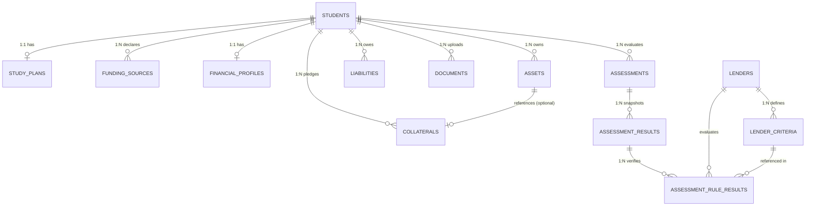

# Finora — Relational Database Schema & Model Specification

> **Document Status:** Authoritative Technical Specification  
> **ORM Framework:** SQLAlchemy 2.0 (`Mapped`, `mapped_column`, Declarative `Base`)  
> **Database Dialect:** SQLite 3 (Production on Render with PRAGMA foreign keys enabled; PostgreSQL-ready via `Numeric` and `DateTime(timezone=True)` abstractions)  
> **Source Directory:** [`backend/app/models/`](file:///home/puneetyadav1625/Projects/Finora/backend/app/models/)

---

## 1. Entity-Relationship Architecture

---

## 2. Table Specifications & Column Dictionaries

### 2.1 Table: `students`
Primary entity representing candidate loan applicants.

| Column Name | SQLAlchemy Type | Nullable | Constraints & Index | Description |
| :--- | :--- | :--- | :--- | :--- |
| `id` | `Integer` | No | `PRIMARY KEY`, Autoincrement | Unique student surrogate identifier |
| `name` | `String(150)` | No | — | Applicant legal full name |
| `email` | `String(255)` | No | `UNIQUE`, `INDEX` | Unique contact email address |
| `country_of_origin` | `String(100)` | No | Default: `'India'` | Applicant nationality / residency |
| `target_country` | `String(100)` | No | — | Study destination corridor (e.g. USA, Germany) |
| `target_university` | `String(255)` | No | — | University or higher-ed institution |
| `target_course` | `String(255)` | No | — | Degree program title (e.g. MS in CS) |
| `created_at` | `DateTime(timezone=True)` | No | Server default: `func.now()` | Record creation timestamp |
| `updated_at` | `DateTime(timezone=True)` | No | Server default, onupdate | Last modification timestamp |

**Cascade Rules:** Deleting a `students` record triggers cascading deletion across all 8 child tables: `study_plans`, `funding_sources`, `financial_profiles`, `assets`, `liabilities`, `collaterals`, `documents`, and `assessments`.

---

### 2.2 Table: `study_plans`
Academic program cost structure linked 1-to-1 with applicant.

| Column Name | SQLAlchemy Type | Nullable | Constraints & Index | Description |
| :--- | :--- | :--- | :--- | :--- |
| `id` | `Integer` | No | `PRIMARY KEY`, Autoincrement | Primary key |
| `student_id` | `Integer` | No | `FOREIGN KEY (students.id) ON DELETE CASCADE`, `INDEX` | Owning student ID |
| `tuition_fee` | `Numeric(14, 2)` | No | Default: `0.00` | Program tuition in native currency |
| `living_expenses` | `Numeric(14, 2)` | No | Default: `0.00` | Estimated living costs in native currency |
| `travel_expenses` | `Numeric(14, 2)` | No | Default: `0.00` | Relocation & visa costs |
| `other_expenses` | `Numeric(14, 2)` | No | Default: `0.00` | Books, health insurance & misc |
| `currency` | `String(10)` | No | Default: `'USD'` | ISO 4217 currency code |
| `duration_months` | `Integer` | No | Default: `24` | Total program duration in months |
| `exchange_rate_to_inr` | `Numeric(10, 4)` | No | Default: `85.00` | Foreign exchange rate to INR |
| `total_cost_original` | `Numeric(14, 2)` | No | Default: `0.00` | Computed sum in program currency |
| `total_cost_inr` | `Numeric(14, 2)` | No | Default: `0.00` | Computed total in INR |
| `created_at` / `updated_at` | `DateTime(timezone=True)` | No | Timestamps | Audit timestamps |

---

### 2.3 Table: `funding_sources`
Declared personal, family, and scholarship self-funding resources.

| Column Name | SQLAlchemy Type | Nullable | Constraints & Index | Description |
| :--- | :--- | :--- | :--- | :--- |
| `id` | `Integer` | No | `PRIMARY KEY`, Autoincrement | Primary key |
| `student_id` | `Integer` | No | `FOREIGN KEY (students.id) ON DELETE CASCADE`, `INDEX` | Owning student ID |
| `source_type` | `Enum(FundingSourceType)` | No | `savings`, `scholarship`, `family_support`, `other` | Category of funding |
| `amount_original` | `Numeric(14, 2)` | No | Default: `0.00` | Declared amount in source currency |
| `currency` | `String(10)` | No | Default: `'INR'` | Currency code |
| `exchange_rate_to_inr` | `Numeric(10, 4)` | No | Default: `1.00` | FX rate used for conversion |
| `amount_inr` | `Numeric(14, 2)` | No | Default: `0.00` | Normalized amount in INR |
| `verified` | `Boolean` | No | Default: `False` | Documented / bank verified status |
| `created_at` / `updated_at` | `DateTime(timezone=True)` | No | Timestamps | Audit timestamps |

---

### 2.4 Table: `financial_profiles`
Consolidated household cash-flow, requested loan parameters, and pre-computed ratios.

| Column Name | SQLAlchemy Type | Nullable | Constraints & Index | Description |
| :--- | :--- | :--- | :--- | :--- |
| `id` | `Integer` | No | `PRIMARY KEY`, Autoincrement | Primary key |
| `student_id` | `Integer` | No | `FOREIGN KEY (students.id) ON DELETE CASCADE`, `INDEX` | Owning student ID |
| `monthly_income` | `Numeric(14, 2)` | No | Default: `0.00` | Primary/co-borrower monthly net income |
| `existing_monthly_obligations`| `Numeric(14, 2)` | No | Default: `0.00` | Sum of existing monthly EMIs |
| `monthly_living_expenses` | `Numeric(14, 2)` | No | Default: `0.00` | Declared household living expenses |
| `requested_loan_amount` | `Numeric(14, 2)` | No | Default: `0.00` | Proposed principal loan in INR |
| `loan_tenure_months` | `Integer` | No | Default: `120` | Repayment tenure (months) |
| `loan_interest_rate` | `Numeric(5, 2)` | No | Default: `10.50` | Indicative annual rate (%) |
| `proposed_emi` | `Numeric(14, 2)` | No | Default: `0.00` | Computed monthly EMI |
| `foir` | `Numeric(6, 4)` | No | Default: `0.00` | Computed FOIR ratio |
| `total_assets_inr` | `Numeric(14, 2)` | No | Default: `0.00` | Aggregated asset valuations |
| `total_liabilities_inr` | `Numeric(14, 2)` | No | Default: `0.00` | Aggregated outstanding debt |
| `net_worth_inr` | `Numeric(14, 2)` | No | Default: `0.00` | Net worth (Assets - Liabilities) |
| `created_at` / `updated_at` | `DateTime(timezone=True)` | No | Timestamps | Audit timestamps |

---

### 2.5 Table: `assets` & Table: `liabilities`

#### `assets`
- `id` (`Integer`, PK)
- `student_id` (`Integer`, FK -> `students.id` ON DELETE CASCADE)
- `asset_type` (`Enum`: `property`, `fixed_deposit`, `mutual_funds`, `shares`, `gold`, `vehicle`, `other`)
- `description` (`String(255)`, Nullable)
- `estimated_value_inr` (`Numeric(14, 2)`)
- `is_liquid` (`Boolean`, Default: `False`)

#### `liabilities`
- `id` (`Integer`, PK)
- `student_id` (`Integer`, FK -> `students.id` ON DELETE CASCADE)
- `liability_type` (`Enum`: `home_loan`, `personal_loan`, `car_loan`, `credit_card`, `education_loan`, `other`)
- `lender_name` (`String(150)`, Nullable)
- `outstanding_amount_inr` (`Numeric(14, 2)`)
- `monthly_emi_inr` (`Numeric(14, 2)`)

---

### 2.6 Table: `collaterals`
Pledged security with haircut valuations and encumbrance tracking.

| Column Name | SQLAlchemy Type | Nullable | Description |
| :--- | :--- | :--- | :--- |
| `id` | `Integer` | No | Primary key |
| `student_id` | `Integer` | No | `FOREIGN KEY (students.id) ON DELETE CASCADE` |
| `asset_id` | `Integer` | Yes | `FOREIGN KEY (assets.id) ON DELETE SET NULL` |
| `collateral_type` | `Enum(CollateralType)` | No | `property`, `fixed_deposit`, `gold`, `government_bonds`, `insurance_policy`, `other` |
| `ownership_status` | `Enum(OwnershipStatus)` | No | `sole`, `joint_parent`, `joint_third_party`, `third_party` |
| `description` | `String(255)` | Yes | Description / title deed reference |
| `market_value_inr` | `Numeric(14, 2)` | No | Gross unadjusted market value |
| `existing_encumbrance_inr`| `Numeric(14, 2)` | No | Mortgages or prior liens |
| `eligible_value_inr` | `Numeric(14, 2)` | No | Value post-haircut and ownership factors |

---

### 2.7 Table: `documents`
Pre-underwriting uploaded verification artifacts.

| Column Name | SQLAlchemy Type | Nullable | Description |
| :--- | :--- | :--- | :--- |
| `id` | `Integer` | No | Primary key |
| `student_id` | `Integer` | No | `FOREIGN KEY (students.id) ON DELETE CASCADE` |
| `assessment_id` | `Integer` | Yes | Optional assessment snapshot linkage |
| `document_type` | `Enum(DocumentType)` | No | `passport`, `admission_letter`, `salary_slip`, `bank_statement`, `itr`, `property_document`, etc. |
| `file_name` | `String(255)` | No | Sanitized file name |
| `file_path` | `String(500)` | No | Isolated disk path in sandboxed `/uploads` directory |
| `mime_type` | `String(100)` | No | Validated MIME type (`application/pdf`, `image/png`, `image/jpeg`) |
| `file_size` | `Integer` | No | Byte count (maximum 10,485,760 bytes / 10MB) |
| `status` | `Enum(DocumentStatus)` | No | `missing`, `uploaded`, `processing`, `verified`, `rejected`, `needs_review` |
| `extraction_status` | `Enum(ExtractionStatus)` | No | `pending`, `extracted`, `failed`, `not_applicable` |
| `extracted_data_json` | `Text` | Yes | JSON string of verified regex/OCR evidence |
| `uploaded_at` / `verified_at` | `DateTime(timezone=True)` | Nullable | Lifecycle timestamps |

---

### 2.8 Tables: `lenders` & `lender_criteria`

#### `lenders`
- `id` (`Integer`, PK)
- `name` (`String(150)`, UNIQUE, INDEX)
- `description` (`Text`, Nullable)
- `active` (`Boolean`, Default: `True`)

#### `lender_criteria`
- `id` (`Integer`, PK)
- `lender_id` (`Integer`, FK -> `lenders.id` ON DELETE CASCADE)
- `criterion_type` (`Enum`: `min_cibil`, `max_foir`, `max_loan_amount`, `target_country`, `min_course_level`, `collateral_required`, `min_co_borrower_income`, `custom`)
- `operator` (`Enum`: `gte`, `lte`, `eq`, `neq`, `in`, `not_in`, `contains`)
- `threshold_value` (`Numeric(14, 4)`, Nullable)
- `threshold_text` (`String(255)`, Nullable)
- `required` (`Boolean`, Default: `True` — Hard constraint vs review trigger)
- `weight` (`Numeric(5, 2)`, Default: `1.00`)
- `configuration_json` (`Text`, Nullable)

---

### 2.9 Tables: `assessments`, `assessment_results`, & `assessment_rule_results`

#### `assessments`
- `id` (`Integer`, PK)
- `student_id` (`Integer`, FK -> `students.id` ON DELETE CASCADE, INDEX)
- `requested_loan_amount` (`Numeric(14, 2)`)
- `status` (`Enum`: `pending`, `in_progress`, `completed`, `failed`)
- `created_at` / `completed_at` (`DateTime(timezone=True)`)

#### `assessment_results`
- `id` (`Integer`, PK)
- `assessment_id` (`Integer`, FK -> `assessments.id` ON DELETE CASCADE, INDEX)
- `total_study_cost` (`Numeric(14, 2)`)
- `available_funding` (`Numeric(14, 2)`)
- `funding_gap` (`Numeric(14, 2)`)
- `net_worth` (`Numeric(14, 2)`)
- `foir` (`Numeric(6, 4)`)
- `ltv` (`Numeric(6, 4)`)
- `readiness_score` (`Numeric(5, 2)`)

#### `assessment_rule_results`
- `id` (`Integer`, PK)
- `assessment_result_id` (`Integer`, FK -> `assessment_results.id` ON DELETE CASCADE, INDEX)
- `lender_id` (`Integer`, FK -> `lenders.id` ON DELETE CASCADE, INDEX)
- `criterion_id` (`Integer`, FK -> `lender_criteria.id` ON DELETE SET NULL, Nullable)
- `passed` (`Boolean`)
- `actual_value` (`String(255)`, Nullable)
- `expected_value` (`String(255)`, Nullable)
- `reason` (`Text`, Nullable)

---

## 3. Database Engine & Session Management

**Module:** [`backend/app/db/session.py`](file:///home/puneetyadav1625/Projects/Finora/backend/app/db/session.py)

1. **Foreign Key Enforcement:** SQLite does not enforce foreign keys by default. Finora registers a listener on the engine's `connect` event executing `PRAGMA foreign_keys=ON;` ensuring relational cascades behave identically to PostgreSQL in production.
2. **Thread Safety:** Configured with `connect_args={"check_same_thread": False}` to allow concurrent asynchronous FastAPI request handling across multiple worker threads.
3. **Session Dependency:** `get_db()` FastAPI dependency wraps database interactions in transactional blocks, automatically closing connections upon response completion.
