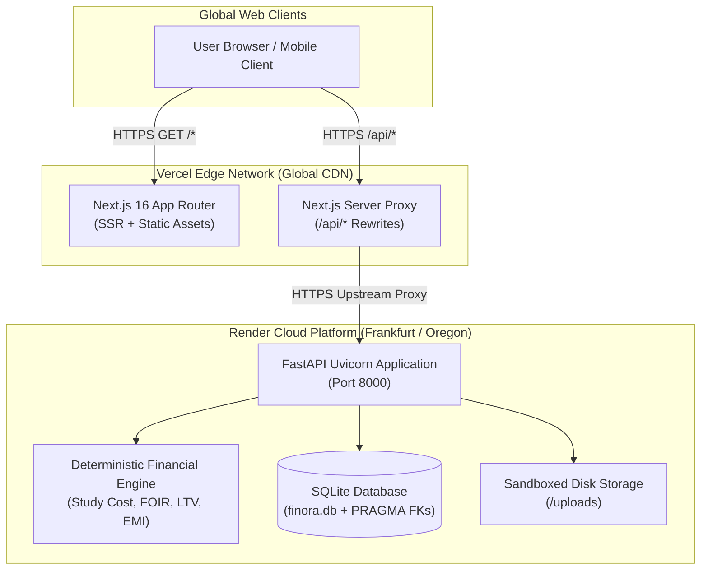

# Finora — Production & Local Deployment Runbook

> **Document Status:** Authoritative Operations Runbook  
> **Production Live Topology:**  
> - **Frontend (Vercel):** [https://finora-pi-rust.vercel.app](https://finora-pi-rust.vercel.app)  
> - **Backend API (Render):** [https://finora-backend-7pe7.onrender.com](https://finora-backend-7pe7.onrender.com)  
> - **API Health Check:** [https://finora-backend-7pe7.onrender.com/health](https://finora-backend-7pe7.onrender.com/health)  
> - **OpenAPI Documentation:** [https://finora-backend-7pe7.onrender.com/docs](https://finora-backend-7pe7.onrender.com/docs)

---

## 1. Architecture & Deployment Topology

Finora is deployed using a decoupled, multi-cloud architecture optimized for high performance, zero-latency static asset delivery, and deterministic compute isolation:



---

## 2. Frontend Deployment Runbook (Vercel)

The frontend is deployed on **Vercel** with native Next.js Turbopack build optimizations.

### 2.1 Vercel Project Settings
- **Framework Preset:** `Next.js`
- **Root Directory:** `./`
- **Node.js Version:** `20.x` or `22.x`
- **Build Command:** `npm run build`
- **Output Directory:** `.next`
- **Install Command:** `npm install`

### 2.2 Environment Variables on Vercel
In the Vercel Dashboard (**Project $\rightarrow$ Settings $\rightarrow$ Environment Variables**):

| Key | Value | Target Environments |
| :--- | :--- | :--- |
| `NEXT_PUBLIC_API_URL` | `https://finora-backend-7pe7.onrender.com` | Production, Preview, Development |

### 2.3 Verification & Deployment Steps
1. Push code to the `main` branch of GitHub repository `puneetnith28/Finora`.
2. Vercel automatically detects commits and initiates deployment build.
3. Verify build logs for clean TypeScript compilation and Turbopack bundle creation.
4. Access the live URL: `https://finora-pi-rust.vercel.app`.

---

## 3. Backend Deployment Runbook (Render)

The backend API is deployed as a Docker Web Service on **Render**.

### 3.1 Render Web Service Settings
- **Service Type:** Web Service
- **Source Repository:** `puneetnith28/Finora`
- **Branch:** `main`
- **Runtime / Environment:** `Docker`
- **Docker Context Directory:** `backend`
- **Dockerfile Path:** `Dockerfile` (located inside `backend/Dockerfile` or referenced as `./backend/Dockerfile`)
- **Region:** `Frankfurt (EU Central)` or `Oregon (US West)`
- **Instance Type:** `Free` or `Starter`
- **Health Check Path:** `/health`
- **Auto-Deploy:** Enabled on git push

### 3.2 Environment Variables on Render
In the Render Dashboard (**Dashboard $\rightarrow$ Web Service $\rightarrow$ Environment**):

| Key | Value | Purpose |
| :--- | :--- | :--- |
| `ENVIRONMENT` | `production` | Enables production security optimizations and disables debugging logs |
| `DATABASE_URL` | `sqlite:///./finora.db` | Active SQLite connection string |
| `BACKEND_CORS_ORIGINS` | `["https://finora-pi-rust.vercel.app","http://localhost:3000"]` | Whitelists frontend production and local origins |
| `UPLOAD_DIR` | `./uploads` | Storage path for pre-underwriting document attachments |
| `MAX_UPLOAD_SIZE` | `10485760` | 10 MB upload ceiling |

### 3.3 Free-Tier Cold Starts & Persistence Considerations
> [!NOTE]
> On Render's Free tier, services spin down after 15 minutes of inactivity. The first incoming request may take 30–50 seconds to complete cold startup. The SQLite database is automatically initialized and seeded with the 5 demo lenders upon startup in `lifespan(app)`. For permanent production multi-tenant data retention, mount a Render Persistent Disk Volume to `/app/uploads` and `/app/finora.db`, or set `DATABASE_URL` to a managed PostgreSQL cluster.

---

## 4. Local Full-Stack Deployment (Docker Compose)

For local development or air-gapped staging evaluation, run the entire Finora ecosystem with Docker Compose:

### 4.1 Prerequisites
- Docker Engine $\ge 24.0$
- Docker Compose $\ge 2.20$

### 4.2 Start Services
```bash
# Build and start all services in detached mode
docker compose up --build -d

# View container status and health
docker compose ps

# Follow container logs
docker compose logs -f
```

### 4.3 Service Ports
- **Frontend:** `http://localhost:3000`
- **Backend API:** `http://localhost:8000`
- **OpenAPI Swagger:** `http://localhost:8000/docs`

### 4.4 Stop & Clean Up
```bash
# Stop containers
docker compose down

# Stop containers and wipe named volumes
docker compose down -v
```

---

## 5. Local Native Development (Without Docker)

### 5.1 Backend Setup
```bash
cd backend
python -m venv venv
source venv/bin/activate  # On Windows: venv\Scripts\activate
pip install -r requirements.txt
uvicorn app.main:app --host 127.0.0.1 --port 8000 --reload
```

### 5.2 Frontend Setup
```bash
# In the repository root
npm install
npm run dev
```

The Next.js application will launch at `http://localhost:3000` and automatically forward `/api/*` calls to the local FastAPI server at `http://127.0.0.1:8000`.

---

## 6. Post-Deployment Smoke Test & Verification Suite

Execute the following automated curl commands to verify complete end-to-end functionality after any deployment:

### 6.1 Backend Health & DB Liveness
```bash
# 1. Verify service health
curl -s -X GET "https://finora-backend-7pe7.onrender.com/health" | jq .

# 2. Verify database connection
curl -s -X GET "https://finora-backend-7pe7.onrender.com/health/db" | jq .
```
**Expected Output:** Both endpoints return `"status": "healthy"`.

### 6.2 Lender Database Seeding
```bash
# Verify the 5 authoritative lenders are seeded
curl -s -X GET "https://finora-backend-7pe7.onrender.com/api/lenders" | jq '.[].name'
```
**Expected Output:**
```json
"State Bank of India (SBI)"
"Bank of Baroda (BOB)"
"Bank of India (BOI)"
"HDFC Credila"
"Auxilo Finserve"
```

### 6.3 Demo Scenario Execution
```bash
# Trigger automated demo candidate seeding & assessment calculation
curl -s -X POST "https://finora-backend-7pe7.onrender.com/api/demo/seed" | jq .
```
**Expected Output:** `"message": "Successfully seeded and evaluated 5 demo scenarios"`.

### 6.4 Real-Time Simulator Evaluation
```bash
# Run real-time FOIR stress simulation
curl -s -X POST "https://finora-backend-7pe7.onrender.com/api/simulator/foir" \
  -H "Content-Type: application/json" \
  -d '{
    "monthly_net_income_inr": "150000.00",
    "existing_monthly_emi_inr": "10000.00",
    "loan_amount_inr": "4000000.00",
    "annual_interest_rate_percent": "10.00",
    "tenure_months": 120
  }' | jq .
```
**Expected Output:** Correctly calculates `proposed_emi_inr`, `foir_percentage`, and `risk_badge`.

### 6.5 Frontend Proxy Verification
```bash
# Verify Next.js rewrite proxy handles API requests seamlessly
curl -s -X GET "https://finora-pi-rust.vercel.app/api/health" | jq .
```
**Expected Output:** Same JSON payload as backend direct health check.
