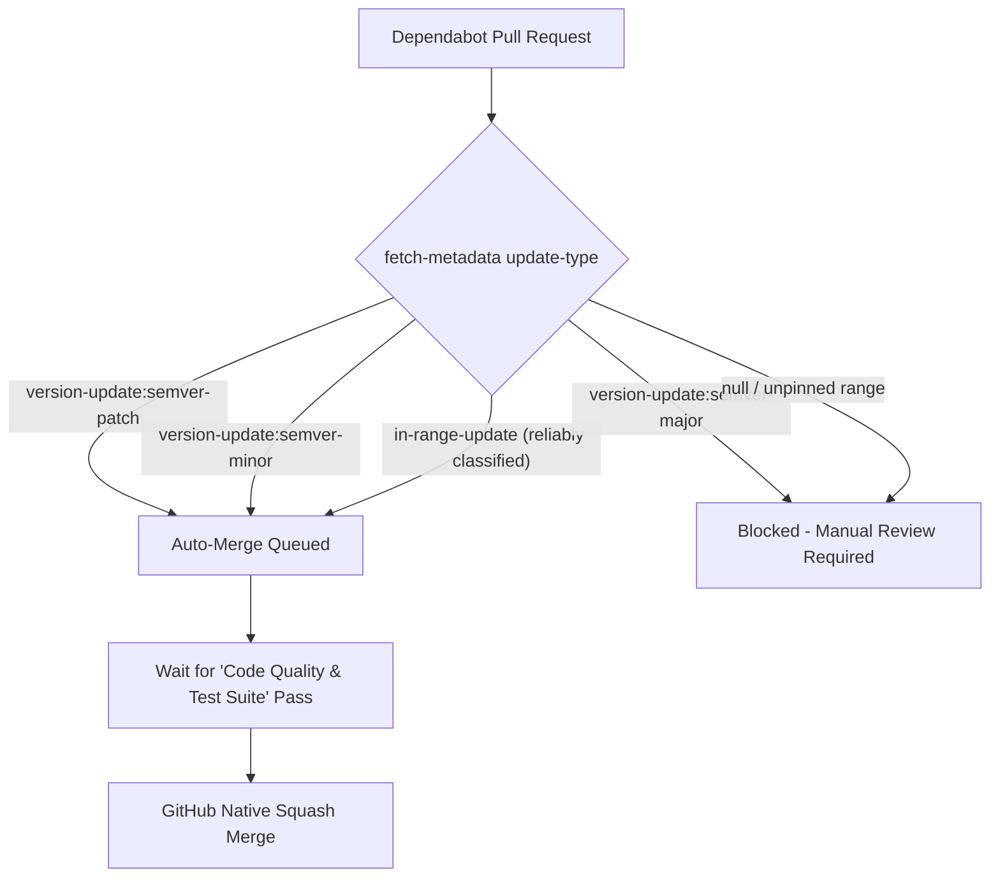

# Finora — Maintenance & Operations Guide

This guide details the maintenance lifecycle, automated quality pipelines, security monitoring, dependency governance, and operational incident response for the **Finora** platform.

---

## 1. Automated CI/CD & Quality Pipelines

All pull requests and pushes to `main` are continuously validated through decoupled GitHub Actions workflows:

| Workflow | File Path | Trigger Events | Purpose & Invariants |
| :--- | :--- | :--- | :--- |
| **CI Quality Matrix** | [`.github/workflows/ci.yml`](../.github/workflows/ci.yml) | `push` & `pull_request` on `main` | Runs frontend type-check (`tsc`), ESLint, Python Ruff linter, Pytest (131 tests), and Alembic migration validation. Required by branch protection under **`Code Quality & Test Suite`**. |
| **CodeQL Security Analysis** | [`.github/workflows/codeql.yml`](../.github/workflows/codeql.yml) | `push`, `pull_request`, weekly cron | Static Application Security Testing (SAST) for `javascript-typescript` and `python` against high-severity CWEs and security regressions. |
| **Dependabot Auto-Merge** | [`.github/workflows/dependabot-automerge.yml`](../.github/workflows/dependabot-automerge.yml) | `pull_request` by `dependabot[bot]` | Safely queues squash merges for eligible `semver-patch` and `semver-minor` updates once all required status checks pass. Blocks major and unverified updates. |
| **Deployment Health Verification** | [`.github/workflows/deployment-health-check.yml`](../.github/workflows/deployment-health-check.yml) | Daily cron & `workflow_dispatch` | Non-destructive HTTP availability and readiness probe for the Vercel frontend and Render FastAPI backend (`/health` and `/health/db`). |

---

## 2. Dependency Management & Auto-Merge Policy

Finora uses GitHub Dependabot ([`.github/dependabot.yml`](../.github/dependabot.yml)) to run weekly dependency scans across two ecosystems:
1. **Frontend (`npm`):** Manifest `package.json` in repository root.
2. **Backend (`pip`):** Manifest `backend/requirements.txt` in `/backend`.

### Auto-Merge Governance Matrix



- **Patch & Minor Updates:** Queued for automated squash-merging via `gh pr merge --auto --squash` upon green CI status.
- **Major Upgrades:** Blocked from auto-merge to prevent breaking API or compiler changes (e.g. `TypeScript 5 -> 7`, `ESLint 9 -> 10`).
- **Unpinned Requirement Ranges:** When metadata returns `null` (e.g. `sqlalchemy>=2.0.28,<3.0.0`), auto-merge is intentionally skipped to ensure human verification.

---

## 3. Investigating a Failed Workflow

When a pull request fails CI:

1. **Locate the Job Failure:** Open the PR $\rightarrow$ click **Checks** $\rightarrow$ select **Code Quality & Test Suite**.
2. **Diagnose by Subsystem:**
   - **Frontend Type-Check:** Run `npm run type-check` locally to reproduce TypeScript errors.
   - **Frontend Lint:** Run `npm run lint` or `npm run format` locally.
   - **Backend Ruff Lint:** Run `./.venv/bin/ruff check backend` locally.
   - **Backend Pytest Failure:** Run `./.venv/bin/pytest backend/tests -k "<failed_test_name>"` with verbose output (`-vv`).
   - **Alembic Migration Error:** Run `./.venv/bin/alembic -c backend/alembic.ini current` to check for schema inconsistencies.
3. **Re-triggering Checks on Stale Dependabot PRs:**
   Comment `@dependabot rebase` on any open Dependabot pull request to rebase onto `main` and trigger fresh CI runs.

---

## 4. Handling Major Dependency Upgrades

When a major version PR is opened (e.g. `ESLint 10`, `TypeScript 7`, `pytest 9`):

1. **Check Out the Branch Locally:**
   ```bash
   git fetch origin dependabot/<ecosystem>/<branch-name>
   git checkout dependabot/<ecosystem>/<branch-name>
   ```
2. **Execute Local Validation:**
   ```bash
   npm run quality
   ```
3. **Inspect Breaking Changes:** Review upstream migration guides for deprecated APIs, configuration schema changes, or altered behavior.
4. **Test Application End-to-End:** Start both dev servers (`npm run dev` and `uvicorn app.main:app`) and verify the 6-step assessment flow and interactive FOIR simulator.
5. **Approve and Merge:** Approve on GitHub and merge using **Squash and merge**.

---

## 5. Security Incident Response & Secret Revocation

If an API key, session secret, or cloud credential is inadvertently committed:

1. **Immediate Revocation (Priority 1):**
   - Access the provider dashboard (Vercel, Render, ElevenLabs, Database) and immediately **delete/rotate** the active credential.
2. **Scrub Git Commit History:**
   - Run `git filter-repo` to permanently erase the sensitive string from Git blobs.
   - Force-push the sanitized history to the remote repository.
3. **Audit Access Logs:**
   - Inspect API access logs and database query logs for suspicious activity during the exposure window.
4. **Report to Maintainers:** Follow the private disclosure guidelines in [`SECURITY.md`](../SECURITY.md).

---

## 6. Manual GitHub Settings & Permissions Reference

The following settings require one-time configuration in the GitHub repository web UI:

1. **Repository Rulesets / Branch Protection:**
   - **Settings** $\rightarrow$ **Rules** $\rightarrow$ **Rulesets** (or **Branches**).
   - Target: `main`.
   - Require a pull request before merging.
   - Require status check: **`Code Quality & Test Suite`**.
2. **Allow Auto-Merge:**
   - **Settings** $\rightarrow$ **General** $\rightarrow$ **Pull Requests** $\rightarrow$ Check **Allow auto-merge**.
3. **GitHub Actions Workflow Permissions:**
   - **Settings** $\rightarrow$ **Actions** $\rightarrow$ **General** $\rightarrow$ **Workflow permissions**.
   - Select **Read and write permissions**.
   - Check **Allow GitHub Actions to create and approve pull requests**.
4. **Code Security & Secret Scanning:**
   - **Settings** $\rightarrow$ **Code security and analysis**.
   - Enable **Dependabot security updates**, **Secret scanning**, and **Push protection** if supported by the repository tier.
